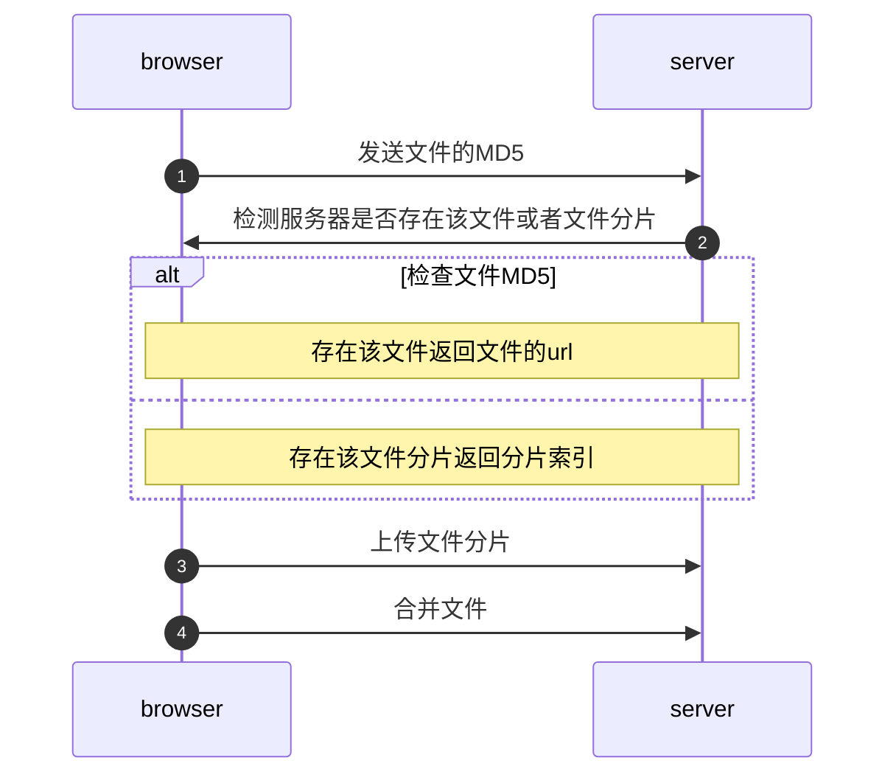

# 文件上传（FileUpload）

操作示例：


上传文件的流程：


在搞懂上传文件之前需要了解一点前置知识：
## Blob对象
Blob表示一个只读的类文件对象，通常用于传输二进制文件

`var blob = new Blob( array, options );`

array 是一个由ArrayBuffer,ArrayBufferView,Blob,DOMString 等对象构成的 Array；options 是一个键值对，用来确定Blob对象包裹的是什么类型的数据，比如：`{ type: file.type }`

Blob包含两种属性
1. size：Blob包含数据的大小，单位是b(字节)；
2. type：Blob 对象所包含数据的MIME类型，比如`.jpg`，`.txt`，不能确定就是空字符串

在上传文件的时候需要将大文件分割然后上传，文件上传失败后，下次上传只需要把未上传完成的片段进行上传。

`blob.slice(startByte, endByte,contentType)`方法就是用来切割Blob所包含的文件，他会从包裹的文件中根据传递的参数读取一段二进制文件，并做为新的对象返回。

startByte表示读取字节的起始位置，endByte则表示结束位置，contentType表示指定新的Blob对象的文件类型。

```javascript
// 使用FormData上传Blob
var formData = new FormData()
// Blob的二进制参数包裹在数组里面
// 如果文件分片了就不需要上传文件类型了，到合并文件分块的时候在上传
formData.append('file', new Blob([file], { type: file.type }))
// ...上传其他的字段
fetch(url, {
    method: "POST",
    body: formData
})
    .then(response => resolve(response.json()))
    .catch(error => reject(error))
```
## FileReader
从Blob中读取内容的唯一方法是使用FileReader。
示例：

```javascript
// 开始读取指定的 Blob中的内容,一旦完成,result 属性中保存的将是被读取文件的ArrayBuffer数据对象。
var fileReader = new FileReader()
// 按字节读取文件内容，并转换为ArrayBuffer对象。
fileReader.readAsArrayBuffer(file)
fileReader.onload = function (e) {
    // 读取操作完成时触发，可以获取到文件内容
    // e.target.result为读取的文件
}
fileReader.onerror = function () {
    // 发生错误时触发
}
```

上传文件并读取的例子：

```html
<!DOCTYPE html>
<html lang="en">

<head>
    <meta charset="UTF-8">
    <meta name="viewport" content="width=device-width, initial-scale=1.0">
    <title>FileReader</title>
</head>

<body>
    <div class="upload">上传文件</div>
    <script>
        var start_dom = document.querySelector('.upload')
        start_dom.addEventListener('click', function () {
            // 创建一个隐藏的input
            var upFileInput = document.createElement('input')
            upFileInput.setAttribute('type', 'file')
            // 上传时可以选择多个文件
            upFileInput.setAttribute('multiple', 'multiple')
            upFileInput.style.display = "none"
            document.body.appendChild(upFileInput)
            upFileInput.click()
            // 检测到有文件上传的时候上传文件
            upFileInput.addEventListener('change', async function () {
                var fileList = Object.values(upFileInput.files)
                // 没有上传文件则跳出
                if (fileList.length === 0) return

                fileList.map(file => {
                    var reader = new FileReader()
                    reader.readAsArrayBuffer(file)
                    reader.onload = function (e) {
                        // FileReader.result；返回文件内容
                        console.log(e.target.result)
                        // 包裹在Blob对象中
                        console.log(new Blob([e.target.result]))
                        console.log('>>>>>>>>>>>>>>>>>>>>解析完一个文件>>>>>>>>>>>>>>>>>>>>')
                    }
                })
                // 删除input
                var inputParentNode = upFileInput.parentNode
                inputParentNode.removeChild(upFileInput)
            })
        })
    </script>
    <style>
        .upload {
            width: 88px;
            height: 36px;
            line-height: 36px;
            text-align: center;
            color: white;
            background-color: #1a73e8;
            cursor: pointer;
        }
    </style>
</body>

</html>
```
控制台输出：


## 文件切片

文件上传之前需要对文件进行切片，传输失败后再次上传只需要上传已上传的分片。

读取文件后需要获取文件的MD5，MD5全名是`MD5信息摘要算法`，对任意长度的明文字符串生成128 bit字节也就是16字节的`摘要`，原始数据的改动会导致`摘要`不一致，一个文件的MD5值相当于文件的身份证，MD5用来后端验证文件的完整性以及避免重复上传文件。

```javascript
// 读取文件
async function reader_file(file) {
    return new Promise((resolve, reject) => {
        // 处理slice兼容问题
        var blobSlice = File.prototype.slice || File.prototype.mozSlice || File.prototype
            .webkitSlice,
            // 限制大小2MB，每一片2MB
            chunkSize = 2 * 1024 * 1024,
            // 计算结果向上取整，获取切片数量，不足一片按照一片算
            chunks = Math.ceil(file.size / chunkSize),
            // 切片列表
            chunksList = [],
            //当前第0片
            currentChunk = 0,
            // 加密方法
            spark = new SparkMD5.ArrayBuffer(),
            // 读取完成
            reader_onload = function (e) {
                let result = e.target.result
                // 添加到缓存中
                spark.append(result)
                // 添加到切片列表中
                chunksList.push(result)
                // 读取下一片
                currentChunk++
                // 继续读取
                if (currentChunk < chunks) loadNext()
                // 读取完成
                else resolve({ chunksList: chunksList, fileHash: spark.end() })
            },
            // 读取错误
            reader_error = function (e) {
                console.log('读取错误！')
                reject(['读取错误！'])
            },
            // 切片方法
            loadNext = function () {
                var reader = new FileReader()
                reader.onload = reader_onload
                reader.error = reader_error
                // 读取起始位置，通过读取的片数
                var start = currentChunk * chunkSize,
                    // 是否为最后一片
                    tail = (start + chunkSize >= file.size ? true : false),
                    // 读取截至位置
                    // 最后一片的截至位置是文件的末尾，不足一片（2MB）按照一片算
                    // 2.1MB，第一片2MB，第二片0.1MB
                    end = (tail ? file.size : start + chunkSize)
                // 触发文件读取事件，文件切片
                reader.readAsArrayBuffer(blobSlice.call(file, start, end))
                // 展示百分比
                tail ? setTableInfo.parse(1) : setTableInfo.parse(start / file.size)
            }
        loadNext()
    })
}
```

## 隐藏input

因为浏览器原生的input难改动样式，通常使用创建一个隐藏的type类型为file的input元素，在触发input的change事件（上传文件时触发），在把文件以表单的形式上传到服务器上

```javascript
// 上传文件
// 假设.upload是一个我们自定义的div，比如用户的头像
var start_dom = document.querySelector('.upload')
// 点击.upload创建隐藏的
start_dom.addEventListener('click', function () {
    // 创建一个隐藏的input[type='file']
    var upFileInput = document.createElement('input')
    upFileInput.setAttribute('type', 'file')
    upFileInput.setAttribute('size', '3')
    // 允许选择多个文件
    upFileInput.setAttribute('multiple', 'multiple')
    // 隐藏
    upFileInput.style.display = "none"
    document.body.appendChild(upFileInput)
    // js模拟点击input，触发change事件
    upFileInput.click()
    // 检测到有文件上传的时候上传文件
    upFileInput.addEventListener('change', async function () {
        // 文件列表
        let fileList = Object.values(upFileInput.files)
        // 没有上传文件则返回
        if (fileList.length === 0) return
        /////////////////////////////////////// 操作或者上传文件    
        // 删除input
        let inputParentNode = upFileInput.parentNode
        inputParentNode.removeChild(upFileInput)
    })
})
```


--------------------------------------------图表代码

